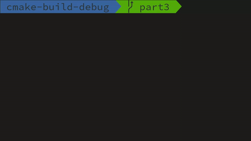

# Gamma

## Rules

The game Gamma is played on a rectangular board of cells. The adjacent cells on the board are those that touch sides (cells that only touch the corners are not considered adjacent). Adjecet cells form an area, if each of those cells can reach another passing only through adjacent cells.

At the beginning of the game the board is empty. Players take turns occupying an empty cell by placing their number tag on it. A player may take any unoccupied cell, as long as the number of areas occupied by the any player may not consist of more than the maximum number of areas for the game (which is the game parameter).

Each player once in the whole game can make a Golden Move, which consists of taking an already occupied cell from another player. However, this move still cannot violate the rule of the maximum number of occupied areas by any player.

The game ends when no player can make a move. The player who takes the most cells wins.

## Batch Mode

The ability to play the game with terminal commans instead of a UI. The goal of the Batch Mode is to reliably test the game's engine.

While in the Batch Mode the game can be started by entering:
*   `B width height players areas` - Will start the game for `players` with a board of size `height` `width` and at max `areas` areas for the game.

After the game has been started in Batch Mode the following commands can be entered:
*   `m player x y` – player `player` attemtps to take the cell at `x` `y`,
*   `g player x y` – player `player` attemtps to make a golden move at `x` `y`,
*   `b player` – prints the number of cells occupied by `player`,
*   `f player` – prints the number of free cells that `player` may take,
*   `q player` – checks if `player` can make a golden move,
*   `p` – prints the game board's current state.

## Interactive Mode
Interactive terminal based version of the game. (termios.h and ansi escape codes were utilized to control the terminal).

Interactive Mode can be started by entering:
*   `I width height players areas`

While in the interactive mode players need to take turns and move the cursor (with arrow keys) to the desired cell and press `space` to take a cell or `G` to make a Golden Move. A player may skip his turn by pressing `C`. The game will end automatically when no more moves are possible. The game can be stopped by pressing `Ctrl+D`.

## Compile

The game can be compiled by running:

    mkdir release
    cd release
    cmake ..
    
Necessary makefile will be created for which:
*   `make` generates an executable `gamma` which starts the Batch Mode
*   `make test` makes an executable `gamma_test` with tests for the game engine,
*   `make doc` generates documentation with `doxygen`.

## Implementation

This game was tasked to be implemented in 3 parts:
 - Part 1: Game Engine
 - Part 2: Batch Mode and Interactive Mode
 - Part 3: Improving Interactive Mode and fixing previous issues
 
 Progress for each part can be found under branches `part1`, `part2`, and `part3`

## Testing

Tests for each part are located [here](https://github.com/gavjan/gamma/releases)

## Demo

